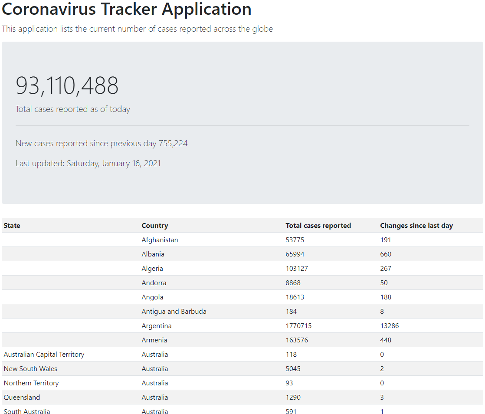

# Spring Boot Coronavirus Tracker
This project was created using ***Spring Boot*** and ***Bootstrap 5***

This application parses a CSV file then uses the Thymeleaf dependancy to format and display the data. Bootstrap is utilized to create a responsive webpage.
- Spring
- Bootstrap 5
- Thymeleaf

